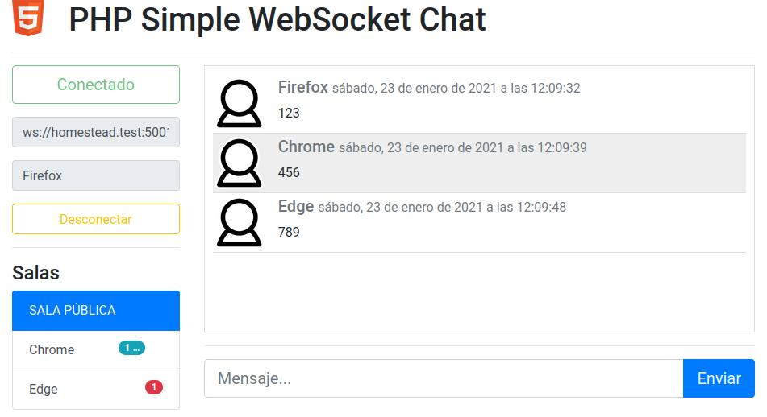

# PHP Simple WebSocket Chat



Usa la librería https://github.com/ghedipunk/PHP-Websockets

## Características
* Sala pública
* Sala privada por usuario conectado
* Contador de mensajes sin leer por sala
* Contador de usuarios escribiendo por sala

## Manual

### Correr servidor

* Mover a la carpeta servidor `cd servidor`
* Opcional: editar parámetros en `chat.php`
* Ejecutar servidor `./chat.php` o `php chat.php`

### Correr en cliente
* Abrir cliente/index.html
* Modificar parámetros de servidor y nombre de usuario
* Conectar

---

### Vagrant Homestead

* Servidor: `$echo = new chat_server("192.168.10.10","5001");`
* En máquina host `myVirtualHost.test/php-simple-websocket-chat/cliente/index.html`

#### Túnel SSH para transmitir por red local
* Maquina host: `ssh -L (local host ip):5001:192.168.10.10:5001 vagrant@homestead.test`
* Máquina en red: `http://(local host ip):8000/php-simple-websocket-chat/cliente/index.html`

---
## [Docker](https://docs.docker.com/get-started/overview/)
### Windows
* Instalación oficial [Install Docker Desktop on Windows](https://docs.docker.com/docker-for-windows/install/)
* Docker Version :
    ```
    Server: Docker Engine - Community
    Engine:
    Version:          20.10.2
    API version:      1.41 (minimum version 1.12)
    Go version:       go1.13.15
    Git commit:       8891c58
    Built:            Mon Dec 28 16:15:28 2020
    OS/Arch:          linux/amd64
    Experimental:     false
    containerd:
    Version:          1.4.3
    GitCommit:        269548fa27e0089a8b8278fc4fc781d7f65a939b
    runc:
    Version:          1.0.0-rc92
    GitCommit:        ff819c7e9184c13b7c2607fe6c30ae19403a7aff
    docker-init:
    Version:          0.19.0
    GitCommit:        de40ad0
    ```
* [PHP Docker Official Images](https://hub.docker.com/_/php)
 * [Tag: 7.4-apache](https://github.com/docker-library/php/blob/74175669f4162058e1fb0d2b0cf342e35f9c0804/7.4/buster/apache/Dockerfile) 
 * Esta imagen contiene Apache httpd de Debian junto con PHP
 * PHP Version 7.4.14
 * Apache 2.0 Handler

### Creación del contenedor
* Correr `create_container.bat`
 * El batch file realiza el pull de la imagen de Docker Hub.

### Como correr el contenedor
* Correr `run_container.bat`
 * Al terminal el cmd el contenedor se debe de borrar automáticamente, de no hacerlo eliminarlo desde el dashboard o usando el comando `docker container rm [container_id]`.
 * Cambiar el tamaño de cmd puede detener el servidor Apache.

### Como acceder a la terminal del contender
* Correr `run_container_bash.bat`
 * [docker exec](https://docs.docker.com/engine/reference/commandline/exec/)

### Como correr el servidor
* Correr `run_chat_server.bat`

### Como acceder al cliente
* Desde el navegador 
 * (http://localhost/)
 * (http://localhost/php-simple-websocket-chat/cliente/)

### Work in Progress
**Nota:** Implementación aun en desarrollo.
* Error actual al ejecutar `php php-simple-websocket-chat/servidor/chat.php`
```
Fatal error: Uncaught Error: Call to undefined function socket_create() in /var/www/html/php-simple-websocket-chat/servidor/PHP-Websockets-master/websockets.php:22
Stack trace:
#0 /var/www/html/php-simple-websocket-chat/servidor/chat.php(128): WebSocketServer->__construct('127.0.0.1', '5001')
#1 {main}
  thrown in /var/www/html/php-simple-websocket-chat/servidor/PHP-Websockets-master/websockets.php on line 22
```
